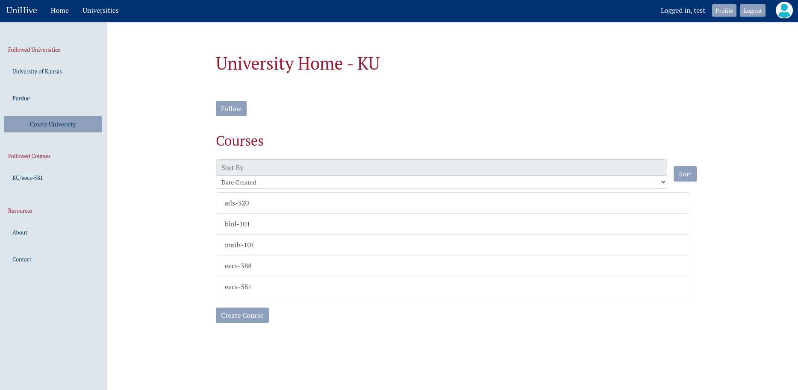

# UniHive 
UniHive is what is happening on your campus academically.   

Serving the academic discourse. 

A project made for EECS 581 (Software Engineering II) 


## Setup 
1) Make a virtual environment
```
$ python -m venv .venv
```
2) activate the virtual environment 

```
. .venv/bin/activate
```

3) install flask
```
$ pip install Flask
```

Or follow the official Flask docs: https://flask.palletsprojects.com/en/3.0.x/installation/

## Usage 
In the project root directory: 
```
$ flask --app app/main run --debug
```
Then open the app using the url in the terminal. 

Alternatively: 
- you can run it with python 
```
$ python3 app/main.py
```

## Tech Stack 
- Flask 
- Postgre SQL
- Bootstrap 


